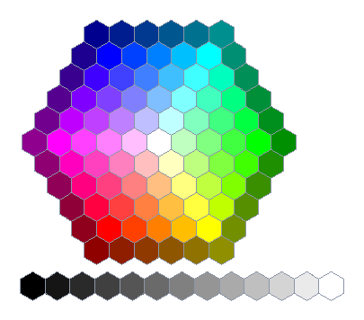

# Pascal Typing: Keystroke Trace Simulator & Auto-Typer

A high-fidelity keystroke trace simulator and auto-typer featuring motor kinematics (Fitts' Law ID, hand alternation), cognitive models (Ornstein-Uhlenbeck pace drift, fatigue, log-normal dwells, error episodes), editor auto-indent integration, and an intelligent **Coding Mode** with Pascal `begin`/`end` lookahead.

## Key Features

1. **Stochastic Timing & Kinematic Modeling**
   - **Inter-Key Interval (IKI)**: Gammavariate distributions parameterized by WPM, Fitts' difficulty index, hand alternation, digraph speed-ups, syntax delays, and shift modifier reach penalties.
   - **Dwell Time**: Log-normally distributed key hold durations adapted to current pace and key type.
   - **Pace Drift & Fatigue**: Exact Ornstein-Uhlenbeck discretisation with mean-reversion and workload/recovery dynamics.
   - **Error Episodes**: Naturalistic typing errors (substitution, transposition, omission, insertion, overshoot) with realization pauses and backspace corrections.
   - **Natural Thinking Pauses**: Pauses occur naturally at word boundaries rather than within runs of whitespace.

2. **Editor Auto-Indent Policies**
   - `"off"`: Types text verbatim without deleting indentation.
   - `"copy"`: Automatically predicts and clears indentation copied from the preceding line.
   - `"smart"`: Predicts additional indentation levels opened by block characters (`:`, `{`, `(`, `[`) or Pascal keywords (`begin`, `then`, `do`, `try`, etc.).
   - `"fixed"`: Issues a fixed count of backspaces after each newline.
   - `tab_stop_backspace`: Supports editor behavior where Backspace removes full indentation levels at once (e.g. VS Code smart backspace).

3. **Coding Mode (Pascal / Structured Code Lookahead)**
   - Scans forward to detect matching `begin` ... `end` blocks (with full support for nested blocks, comments, and string literals).
   - Types out the block frame (`begin`, newline, `end`), navigates back up (`<UP>`), fills in all body statements in logical order, and navigates down (`<DOWN>`) past the closing `end`.
   - Produces 100% exact source code in the target editor while capturing authentic coding behavior.

## CLI Usage

### Run Benchmark (Simulated, no keys pressed)
```bash
python auto_typer.py --benchmark --wpm 110 --mode net --typo 3.0 --seed 12345
```

### Benchmark Coding Mode on a Pascal File
```bash
python auto_typer.py --benchmark --coding-mode --file program.pas --indent smart
```

### Export Keystroke Trace to CSV
```bash
python auto_typer.py --benchmark --wpm 100 --seed 42 --csv trace.csv --coding-mode --file program.pas
```

## Running the Test Suite

```bash
python -m unittest test_auto_typer.py
```

## Custom UI Colours (v2.0.1)



Version 2.0.1 reworks the appearance settings:

- **`Warm Terracotta` has been removed** from the built-in palettes, and every palette after it shifts one place along, so the grid now ends with a free slot for your own colours.
- **New “Custom UI colour” section** in ⚙ Settings. Press **🎨 New colours…** to open the editor, which uses the *Microsoft Paint / Office style colour hexagon* — a honeycomb of discrete hexagonal swatches (white in the middle, tints fanning out by hue, darker shades on the rim) plus a black‑to‑white hexagon strip. It is deliberately **not** the gradient/"Define Custom Colors" square.
- Choose a **Primary**, **Accent** and **Background** colour (click a hexagon or type `#RRGGBB`), watch the live preview, give the set a name, and **Save colours**.
- Saved palettes appear in the palette grid marked with a ★, are applied instantly, survive restarts (stored in `~/.pascal_typing_v2_settings.json`), and can be re-opened for editing by double-clicking a card or pressing **Edit selected**. **Delete selected** removes one; built-in palettes cannot be deleted. Up to 16 custom palettes are kept.

### Tests

```bash
python -m unittest test_custom_colours.py test_update_checker.py
```

`test_custom_colours.py` covers both the pure honeycomb model (geometry, colour ramps, saved-palette validation) and the Tk widgets themselves, driven through a miniature `tkinter` stub so the suite runs headlessly on machines with no display.
